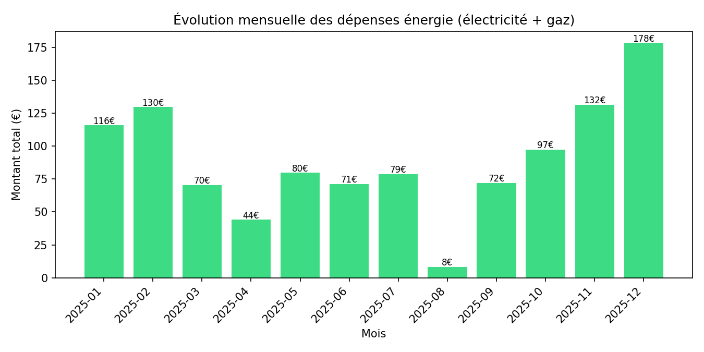

# ⚡ Analyseur de consommation énergie

Script Python qui analyse des relevés de consommation électricité et gaz,
nettoie automatiquement les données invalides, et génère un rapport complet
avec graphique et export Excel.



## Ce que fait le script

- 📥 **Lit** un fichier CSV de relevés de consommation (date, type d'énergie, kWh, montant)
- 🧹 **Nettoie** automatiquement les lignes invalides (valeurs manquantes, négatives, non numériques) sans les supprimer silencieusement
- 📊 **Calcule** les statistiques par type d'énergie : total, moyenne, nombre de relevés
- 📈 **Génère** un graphique de l'évolution mensuelle des dépenses
- 📄 **Exporte** un rapport Excel complet avec le graphique intégré
- ⚠️ **Trace** chaque ligne ignorée avec sa raison exacte, dans un fichier JSON séparé

## Pourquoi ce projet

Les relevés de consommation énergie contiennent presque toujours des données
imparfaites — un compteur non relevé, une saisie manuelle incorrecte, une
valeur manquante. Ce script gère ces cas réels au lieu de simplement planter
ou d'ignorer silencieusement les erreurs.

## Installation

```bash
git clone https://github.com/TON_PSEUDO/analyseur-energie.git
cd analyseur-energie
pip install -r requirements.txt
```

## Utilisation

```bash
python analyseur_energie.py
```

Le script lit `consommation_exemple.csv` par défaut. Pour analyser ton propre
fichier, remplace ce fichier ou modifie la variable `FICHIER_ENTREE` en haut
du script.

### Format du CSV attendu

```csv
date,type_energie,consommation_kwh,montant_eur
2025-01-05,electricite,320,54.40
2025-01-05,gaz,410,61.50
```

## Fichiers générés

| Fichier | Contenu |
|---|---|
| `evolution_consommation.png` | Graphique en barres des dépenses mensuelles |
| `rapport_consommation.xlsx` | Rapport Excel avec statistiques + graphique intégré |
| `lignes_ignorees.json` | Détail des lignes rejetées et la raison exacte |

## Exemple de sortie console

```
=== Analyseur de consommation énergie ===

✅ Graphique généré : evolution_consommation.png
✅ Rapport Excel généré : rapport_consommation.xlsx
⚠️  3 ligne(s) ignorée(s) — détail dans lignes_ignorees.json

--- Résumé ---
Electricite  | 10 relevés | 3395 kWh | 577.15 €
Gaz          | 11 relevés | 3335 kWh | 500.25 €
Mois le plus cher : 2025-12

✅ Analyse terminée.
```

## Stack technique

- Python 3 — `csv`, `json`, `os` (bibliothèque standard)
- `matplotlib` — génération du graphique
- `openpyxl` — export du rapport Excel

## Améliorations possibles

- Support de plusieurs années avec comparaison année sur année
- Détection automatique des pics de consommation anormaux
- Export en PDF en plus de l'Excel
- Interface web simple pour uploader le CSV

---

**Auteur :** Solofonirina — Développeur Python & IA
📧 solofonirinamiasa@gmail.com
